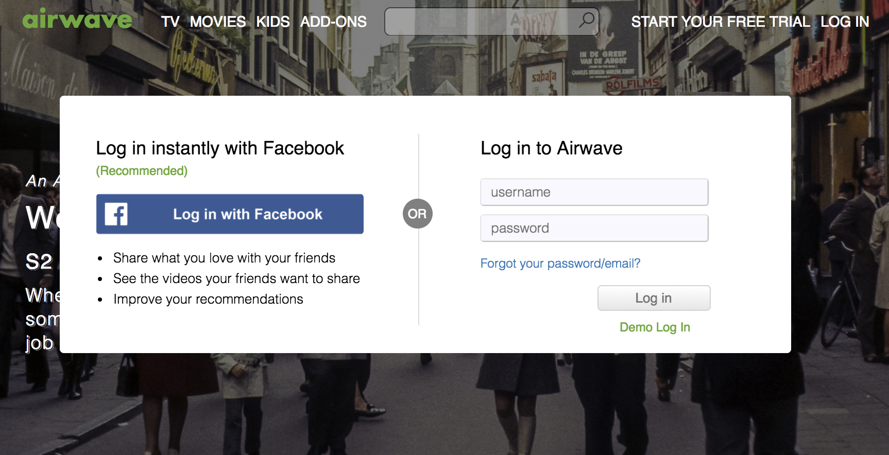
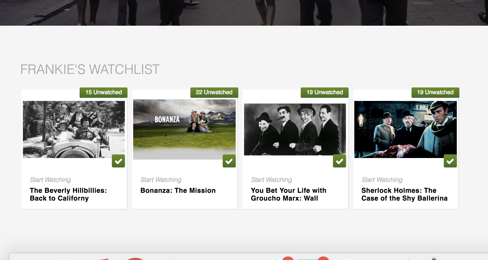
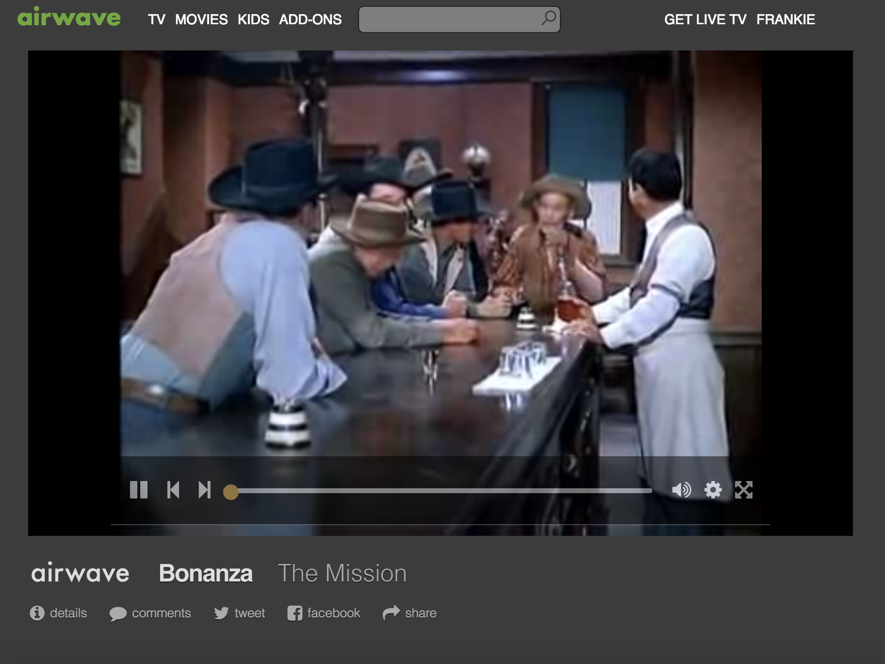
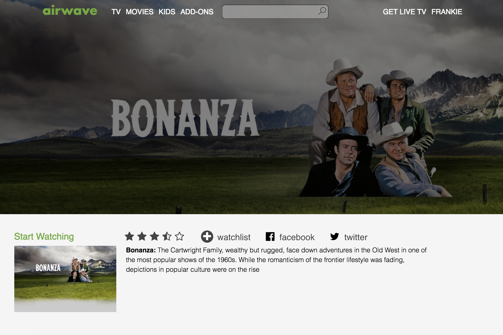
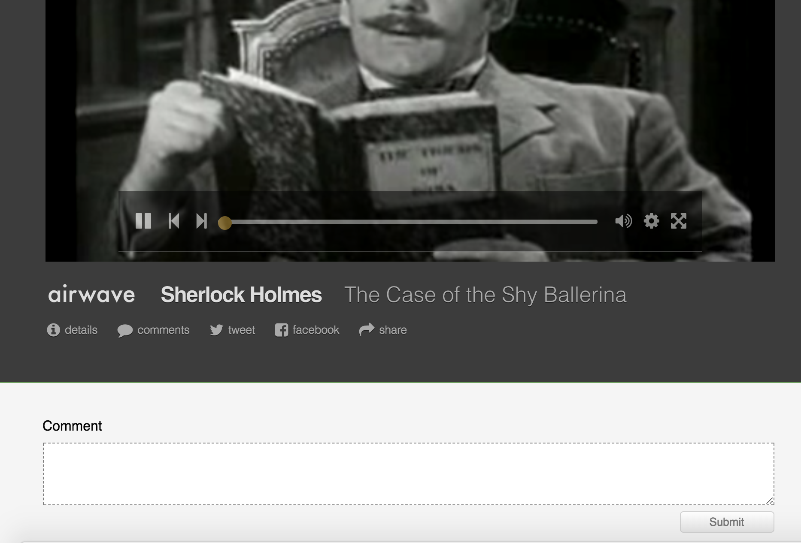
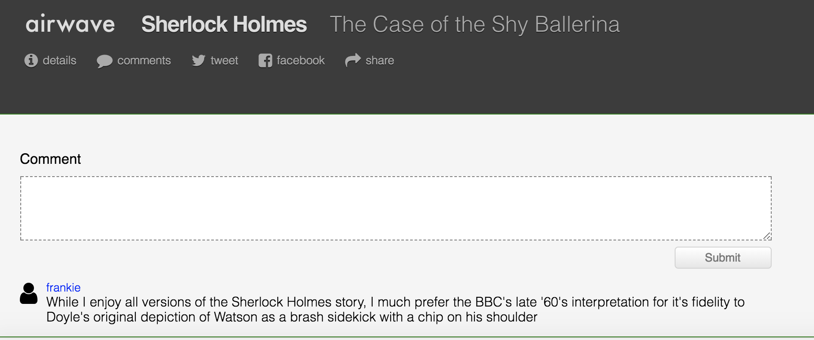

# README

#** Airwave**

[airwave](http://airwavetv.herokuapp.com/#/)

Airwave is a single page Hulu clone built on a Rails framework, with a Postgresql database and a React-Redux frontend. Users can watch episodes of 1950s and 60s TV shows, leave comments for future viewers, and check the description pages of each series.

We made you an account. Let's log in.

Look's like you've put together an exciting watchlist.

A user's watchlist is generated from a join table with two columns: user_id and episode_id.
We just saw the user side in action when you logged in.

The episode_id is drawn from an episodes table with title, description and series_id as columns. But the focal point of the episode table is the video column, generated using Paperclip and seeded using AWS.

Airwave is a video platform, so let's watch a video.

Hmmm ... Bonanza seems like a pretty cool show. You'd like to know more?
Let's press on the show title.

If you'd like to start bingeing Bonanza from the beginning, we've queued up the first episode in our database.

But ... let's cycle back to our landing page and check out another episode. Sherlock, maybe?

You love Sherlock Holmes?! That's good. Why don't you leave a comment and express it.

Okay, I'm glad you're enthusiastic, but it's just a TV show.

